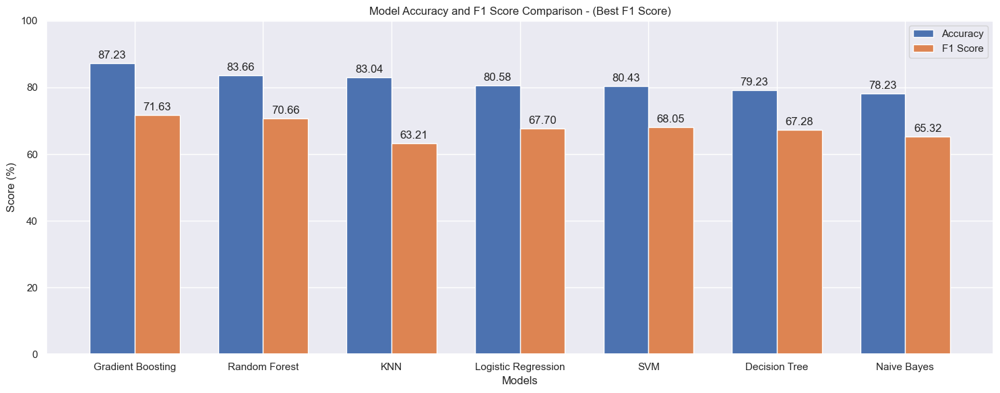

# Adult Income Prediction

## Project Overview
This repository contains an end-to-end machine learning pipeline designed to predict whether an individual earns more than $50K a year based on demographic and employment data. The workflow covers data cleaning, exploratory data analysis, robust preprocessing using scikit-learn pipelines, and the evaluation of multiple classification models.

## Dataset
The project utilizes the Adult Income Dataset. It features 14 demographic and financial variables, including age, workclass, education, marital status, occupation, relationship, race, sex, capital gain, capital loss, hours per week, and native country.
*   **Data Link:** [Kaggle - Adult Income Dataset](https://www.kaggle.com/datasets/wenruliu/adult-income-dataset)

## Repository Structure
The project files are organized as follows:

*   **`model/`**
    *   `app.py`: Deployment script for the predictive application.
    *   `model.py`: Implementation of the final Gradient Boosting model, selected based on its superior performance during model evaluation.
    *   `final_model_weights.pkl`: Serialized weights of the final selected model.
*   **`notebooks/`**
    *   `01_data_cleaning.ipynb`: Identification and handling of missing values, duplicate removal, and categorical normalization using Pandas.
    *   `02_eda.ipynb`: Visualizing numerical and categorical distributions and their relationships with the target variable utilizing Seaborn and Matplotlib.
    *   `03_feature_engineering_preprocessing.ipynb`: Feature engineering, data splitting, and building automated transformation pipelines for numeric scaling and categorical encoding.
    *   `04_modeling_best_acc.ipynb`: Cross-validation and hyperparameter tuning across various classifiers (Logistic Regression, KNN, Decision Tree, Naive Bayes, SVM, Random Forest, Gradient Boosting). Optimized specifically for overall Accuracy[cite: 4].
    *   `04_modeling_best_f1.ipynb`: Evaluates the same set of classifiers, but optimized for the F1-score to better account for class imbalances[cite: 5].
*   **`Project Presentation.pdf`**: Slide deck summarizing the workflow.

## Setup & Execution
*   Run the notebooks sequentially (01 through 04) to replicate the data flow from raw ingestion to final model evaluation.
*   **Requirements:** `pandas`, `numpy`, `matplotlib`, `seaborn`, `scikit-learn`.

## Deployment
The final trained model has been deployed as an interactive web application using Streamlit.Users can access the application, enter the required demographic and employment information, and receive a predicted income class directly through the deployed machine learning model.

**Live Web Application**: https://adult-income-prediction-model.streamlit.app/

## Final Models Benchmark

**Best Model:** Gradient Boosting outperformed all other architectures, achieving the highest metrics with an Accuracy of 87.23% and an F1-Score of 71.63%.
